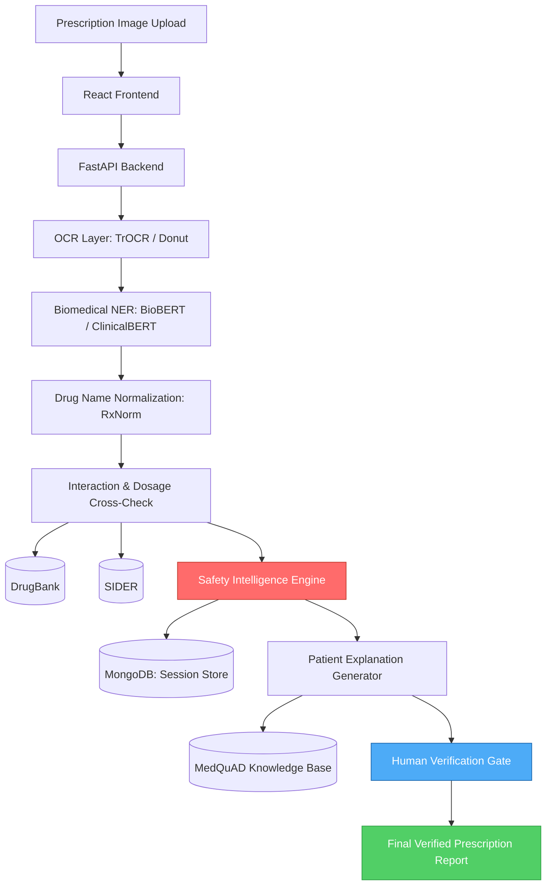
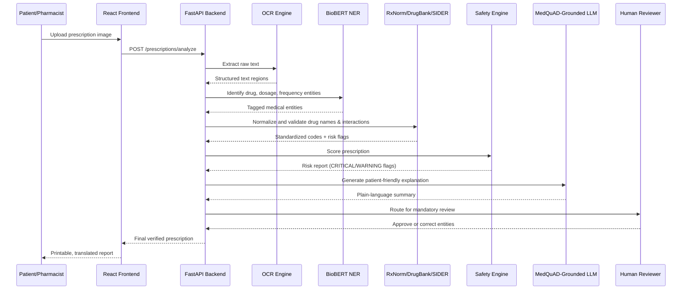

# Prescripto AI 2.0

### Intelligent Clinical Prescription Verification & Patient Safety Platform

[](https://www.python.org/)
[](https://fastapi.tiangolo.com/)
[](https://react.dev/)
[](https://pytorch.org/)
[](https://www.mongodb.com/)

Prescripto AI 2.0 is a clinical decision-support system that verifies handwritten prescriptions before they reach a patient or pharmacist. It extracts structured drug data from prescription images, validates that data against standardized drug ontologies and interaction databases, scores the prescription for risk, and produces a plain-language explanation for the patient — with a mandatory human review step before anything is finalized.

---

## Table of Contents

- [Problem](#problem)
- [Approach](#approach)
- [System Architecture](#system-architecture)
- [Pipeline Flow](#pipeline-flow)
- [Safety Intelligence Engine](#safety-intelligence-engine)
- [Tech Stack](#tech-stack)
- [Datasets & Knowledge Bases](#datasets--knowledge-bases)
- [Output](#output)
- [Local Setup](#local-setup)
- [Project Structure](#project-structure)
- [Reference](#reference)
- [Privacy & Safety Design](#privacy--safety-design)
- [Team](#team)

---

## Problem

Illegible handwriting on prescriptions is a well-documented source of medication errors: misread dosages, missed drug interactions, and duplicate medications routinely go undetected until a patient is already at the pharmacy counter. Existing digitization tools stop at OCR — they convert handwriting to text but do nothing to verify that the extracted data is clinically safe.

## Approach

Prescripto AI 2.0 treats prescription verification as a pipeline problem, not a single-model problem:

1. **Extraction** — dedicated OCR for handwritten medical text, followed by biomedical named-entity recognition to pull out drug names, dosages, and frequencies as structured entities.
2. **Normalization** — extracted drug names are mapped to standardized codes (RxNorm) rather than trusted as free text.
3. **Validation** — normalized entities are cross-checked against interaction and adverse-event databases (DrugBank, SIDER) using deterministic, rule-based logic — not a language model's judgment.
4. **Explanation** — flagged risks are converted into a plain-language summary for the patient, generated by a model grounded in verified medical Q&A data (MedQuAD) to reduce hallucinated advice.
5. **Verification** — no prescription is finalized without a human (pharmacist or physician) confirming it.

The rule-based safety layer is the core of the system. The AI components propose; the deterministic engine and a human reviewer decide.

---

## System Architecture



## Pipeline Flow



---

## Safety Intelligence Engine

A deterministic, non-AI rule layer that produces a numeric safety score and a list of flags. It has no dependency on model confidence and cannot be talked out of a rule by the LLM's output.

| Rule | Trigger | Severity | Score Impact |
|---|---|---|---|
| `EMPTY_EXTRACTION` | No medicines found | CRITICAL | -30 |
| `MISSING_NAME` | Medicine name empty | CRITICAL | -30 |
| `MISSING_DOSAGE` | Dosage field empty | CRITICAL | -30 |
| `DRUG_DRUG_INTERACTION` | RxNorm pair flagged in DrugBank | CRITICAL | -30 |
| `AGE_WEIGHT_DOSAGE_OUT_OF_RANGE` | Dosage outside age/weight-adjusted bounds | CRITICAL | -25 |
| `DUPLICATE_MEDICINE` | Same active ingredient prescribed twice | WARNING | -15 |
| `KNOWN_ALLERGY_CONTRAINDICATION` | SIDER-flagged adverse reaction on record | WARNING | -15 |
| `LOW_CONFIDENCE` | OCR/NER confidence below threshold | WARNING | -10 |
| `SUSPICIOUS_DOSAGE` | Value statistically out of normal range | WARNING | -10 |

```
safetyScore = 100 - (criticalCount × 30) - (warningCount × 10)
```

A prescription cannot reach "final" status without passing the human verification gate, regardless of score.

---

## Tech Stack

| Layer | Technology |
|---|---|
| Frontend | React 18, Tailwind CSS, Vite |
| Backend / API | Python 3.11, FastAPI |
| OCR | TrOCR (Microsoft) / Donut |
| Biomedical NER | BioBERT / ClinicalBERT (HuggingFace Transformers) |
| Drug ontology normalization | RxNorm (NLM) |
| Interaction & adverse event data | DrugBank, SIDER |
| Patient explanation generation | LLM grounded in MedQuAD |
| Database | MongoDB Atlas, PyMongo |
| Evaluation dataset | MIMIC-IV Clinical Database (credentialed access) |
| Deployment | Vercel (frontend), Render/Railway (backend) |

---

## Datasets & Knowledge Bases

| Resource | Purpose | Link |
|---|---|---|
| MIMIC-IV | Credentialed clinical database for evaluation | physionet.org/content/mimiciv/3.1 |
| DrugBank | Drug–drug interaction & dosage data | go.drugbank.com |
| RxNorm | Normalized clinical drug nomenclature (NLM) | nlm.nih.gov/research/umls/rxnorm |
| openFDA Drug Label & Adverse Event API | Structured drug label + AE data | open.fda.gov/apis/drug |
| SIDER | Side-effect resource | sideeffects.embl.de |
| MedQuAD | 47,457 medical QA pairs from 12 NIH sources, grounds patient explanations | github.com/abachaa/MedQuAD |

---

## Output

A verified prescription report flagging:
- Drug–drug interactions
- Dosage exceedance for age/weight
- Duplicate medicines
- Known allergy or contraindication risks

The report includes generic alternatives and a plain-language explanation for the patient in English, Hindi, and Marathi.

---

## Local Setup

### 1. Clone the repository
```bash
git clone https://github.com/dipak0000812/Prescripto-2.0.git
cd Prescripto-2.0
```

### 2. Backend
```bash
cd backend
python -m venv venv
source venv/bin/activate   # Windows: venv\Scripts\activate
pip install -r requirements.txt
```

Create a `.env` file in `backend/`:
```env
PORT=8000
MONGODB_URI=your_mongodb_atlas_uri
HF_API_TOKEN=your_huggingface_token
RXNORM_API_BASE=https://rxnav.nlm.nih.gov/REST
DRUGBANK_API_KEY=your_drugbank_key
JWT_SECRET=your_jwt_secret
FRONTEND_URL=http://localhost:5173
```

```bash
uvicorn app.main:app --reload --port 8000
```

### 3. Frontend
```bash
cd frontend
npm install
```

Create a `.env` in `frontend/`:
```env
VITE_API_URL=http://localhost:8000
```

```bash
npm run dev
```

### 4. Model weights
BioBERT/ClinicalBERT and TrOCR/Donut checkpoints are pulled from HuggingFace Hub on first run and cached under `backend/models/`.

---

## Project Structure

```
Prescripto-2.0/
├── frontend/
│   ├── src/
│   │   ├── components/
│   │   ├── pages/
│   │   └── i18n/                 # English / Hindi / Marathi strings
├── backend/
│   ├── app/
│   │   ├── ocr/                  # TrOCR / Donut pipeline
│   │   ├── ner/                  # BioBERT / ClinicalBERT entity extraction
│   │   ├── ontology/              # RxNorm normalization, DrugBank/SIDER lookups
│   │   ├── safety_engine/         # Deterministic rule-based scoring
│   │   ├── explanation/           # MedQuAD-grounded explanation layer
│   │   ├── routers/
│   │   └── main.py
│   ├── requirements.txt
│   └── tests/
├── docs/
│   ├── architecture.md
│   └── evaluation-mimic-iv.md
└── README.md
```

---

## Reference

Lee, J., Yoon, W., Kim, S., Kim, D., Kim, S., So, C.H., Kang, J. (2020). *BioBERT: A Pre-trained Biomedical Language Representation Model for Biomedical Text Mining.* Bioinformatics, 36(4), 1234–1240. https://doi.org/10.1093/bioinformatics/btz682

---

## Privacy & Safety Design

- **Ephemeral storage** — uploaded images are deleted immediately after OCR/NER processing.
- **TTL indexing** — MongoDB sessions auto-expire after 24 hours.
- **Anonymized sessions** — no persistent user accounts required for the core flow.
- **Human-in-the-loop** — no AI output is treated as final; human verification is mandatory before a report is issued.
- **Credentialed data only** — MIMIC-IV access follows PhysioNet's credentialing and data use agreement; no raw patient data is redistributed.

---

## Team

| Name | Role |
|---|---|
| Dipak | System Architect |
| Bhushan | Backend Development |
| Aakanksha | Frontend Development |
| Prachi| AI/ML Engineer |

---

## License

To be finalized before release.
