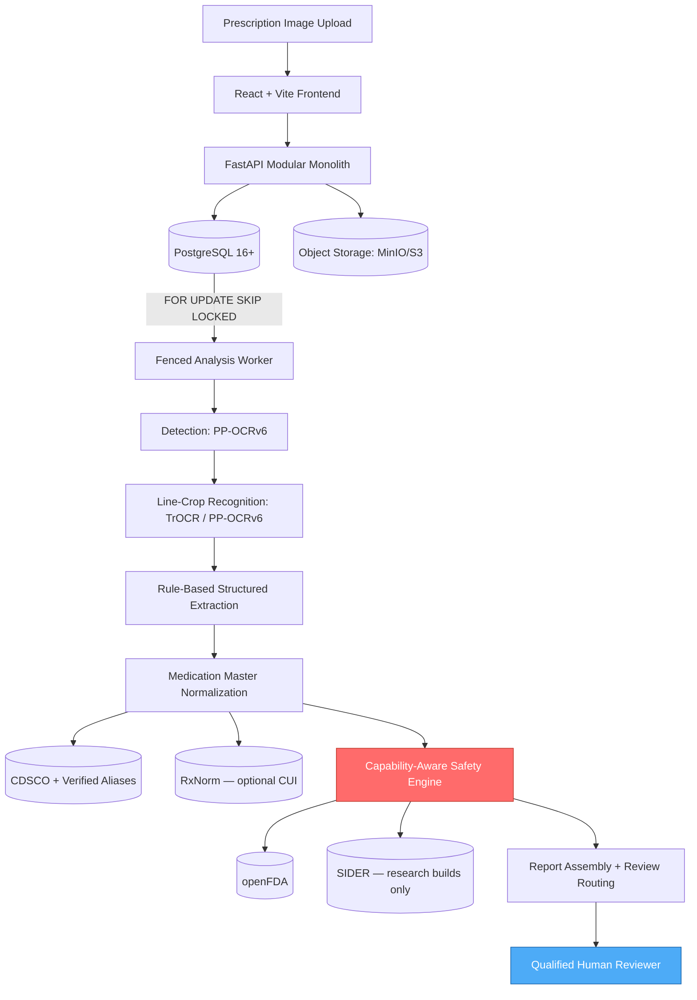
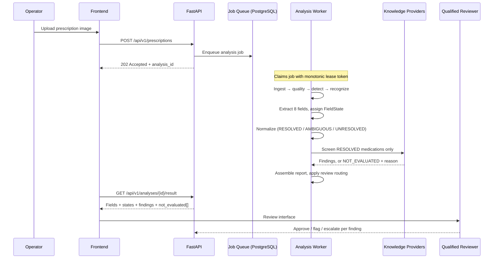

# Prescripto AI 2.0

### Prescription Document Intelligence & Medication-Safety Decision Support

[](https://www.python.org/)
[](https://fastapi.tiangolo.com/)
[](https://react.dev/)
[](https://pytorch.org/)
[](https://www.postgresql.org/)


Prescripto AI 2.0 extracts structured medication data from prescription images, resolves each drug to a canonical identity, screens the result against licensed safety sources, and presents a provenance-backed report to a qualified human reviewer.

It does not diagnose, prescribe, or claim comprehensive interaction coverage. **No finding is actionable until a qualified reviewer signs off.** This is an academic research prototype, not a cleared medical device.

---

## Table of Contents

- [Problem](#problem)
- [Approach](#approach)
- [Project Status](#project-status)
- [System Architecture](#system-architecture)
- [Pipeline Flow](#pipeline-flow)
- [Uncertainty Model](#uncertainty-model)
- [Safety Engine](#safety-engine)
- [What V1 Does and Doesn't Cover](#what-v1-does-and-doesnt-cover)
- [Tech Stack](#tech-stack)
- [Knowledge Sources](#knowledge-sources)
- [Documentation](#documentation)
- [Local Setup](#local-setup)
- [Project Structure](#project-structure)
- [Privacy & Safety Design](#privacy--safety-design)
- [Team](#team)
- [References](#references)
- [License](#license)

---

## Problem

Illegible handwriting on prescriptions is a documented source of medication error — misread dosages, duplicate medications, and missed interactions often go undetected until the pharmacy counter. Existing digitization tools stop at OCR: they convert handwriting to text and do nothing to verify the result is clinically sound.

The harder problem is that a verification system built carelessly is worse than none. A tool that reports "no interactions found" when it simply lacks the data, or reports a drug name it half-guessed, manufactures false confidence in exactly the situation where confidence is most dangerous.

## Approach

Prescripto treats this as a pipeline problem with one governing rule:

> **Upstream uncertainty must never silently become downstream clinical certainty.**

If OCR is unsure, extraction inherits that doubt. If extraction is unsure, normalization does. If a knowledge source has no coverage, the report says so rather than staying quiet. Nothing rounds up to confident.

Concretely:

1. **Extraction** — line-level detection, then handwriting recognition on cropped lines. Every field gets one of four states: `CLEAR`, `AMBIGUOUS`, `UNREADABLE`, `NOT_PRESENT`.
2. **Normalization** — drug names resolve against an internal Medication Master (CDSCO-sourced + verified aliases, RxNorm CUI where one exists). No confident match means `UNRESOLVED` and a trip to human review — never a best guess.
3. **Screening** — deterministic rules over canonical entities. A provider that lacks a capability or times out returns `NOT_EVALUATED` with a reason, never a silent pass.
4. **Review** — a qualified reviewer sees the image, the fields with their states, the findings with their sources, and an explicit list of what was *not* checked.

Only two of eight pipeline stages use a learned model. Dosage parsing and safety screening are deterministic on purpose: a regex that mis-parses `500mg` is debuggable in minutes and fails identically every time; a model that does the same fails unpredictably and needs labeled data just to diagnose.

## Project Status

Documentation-first. Architecture is written and reviewed before implementation begins.

| Phase | Status |
|---|---|
| Discovery & research | ✅ |
| PRD v1 | ✅ Locked |
| System Architecture v1.1 + ADRs | ✅ Locked |
| Full engineering doc set (23 documents) | ✅ Complete |
| Tier B evaluation dataset | 🔲 **Critical path — does not exist yet** |
| Implementation | 🔲 Not started |

No production code exists. Setup instructions below describe the target system.

---

## System Architecture



Single deployable, three processes (`api`, `worker`, `deletion_worker`) from one image. No Redis, Kafka, Kubernetes, vector database, or microservices — each is deferred behind a measured trigger documented in the architecture, and none has fired.

## Pipeline Flow



Analysis is asynchronous throughout. Upload returns before processing starts; the client polls. Stage commits are guarded by lease validation and a generation fencing token, so a slow or crashed worker cannot duplicate findings when another worker picks the job up.

---

## Uncertainty Model

Four field states propagate through every stage:

| State | Meaning | Downstream |
|---|---|---|
| `CLEAR` | High calibrated confidence | Proceeds normally |
| `AMBIGUOUS` | Uncertain or conflicting | Inherited downstream; finding capped at `POTENTIAL` |
| `UNREADABLE` | Illegible | Structurally excluded — passing it downstream raises an exception |
| `NOT_PRESENT` | Absent from the document | Not treated as zero or default |

Model confidence scores are **calibrated per model version** before use. Raw beam-search scores and CTC probabilities aren't comparable and aren't probabilities; thresholding them directly would make review routing arbitrary — which quietly breaks the human-in-the-loop guarantee the whole system rests on. A model without a calibration snapshot cannot load; the worker refuses to start.

There is deliberately **no single "overall confidence" score.** Five clear fields and one ambiguous field is not "96% confident" — it's five of one thing and one of another, reported as such.

## Safety Engine

Deterministic, capability-aware, and entirely independent of any language model. Providers declare what they can answer; a provider that can't answer a check returns `NOT_EVALUATED` with a reason rather than nothing.

**V1 check types:** `DUPLICATE_MEDICATION`, `EVIDENCE_LOOKUP`, `ADVERSE_EFFECT`.

Every finding carries a status from a fixed set:

| Status | Meaning |
|---|---|
| `CONFIRMED_BY_SOURCE` | A named source confirmed it |
| `POTENTIAL` | Flagged, but an input was uncertain |
| `INSUFFICIENT_EVIDENCE` | Source had partial information |
| `NOT_EVALUATED` | Not checked — reason required by database constraint |
| `REQUIRES_REVIEW` | Needs human judgment |

And full provenance: source name, source version, knowledge snapshot ID, check timestamp, confidence, and the medication identities involved. A finding missing any of these is invalid and is never surfaced.

> **The distinction the system is built around:** `NO_KNOWN_INTERACTION_IN_DATABASE` ≠ `NO_INTERACTION_EXISTS`, and `NOT_EVALUATED` ≠ `SAFE`. These are separate values in the data model, the API response, and the UI. Collapsing them is the easiest way to build something actively dangerous.

## What V1 Does and Doesn't Cover

Stated plainly, because a safety tool that overstates its coverage is the failure mode worth avoiding most.

| Supported | Deferred (and why) |
|---|---|
| Medication identity resolution | **Drug–drug interaction checking** — no legally obtainable Indian DDI dataset identified |
| Duplicate medication detection | **Dosage-range checking** — no licensed dosage reference integrated |
| Structured extraction of 8 fields with per-field confidence | **Allergy / contraindication checks** — no patient allergy record intake in V1 |
| Adverse-effect and label evidence lookup | **Patient-facing explanation generation** — LLM disabled in V1 |
| Ambiguity detection and review routing | **Multi-language reports** — English only |
| Coverage-honest reporting | **Automated model deployment** — needs measured regression gates first |

**Not supported, by design:** diagnosis, treatment recommendation, autonomous prescribing, comprehensive clinical validation.

The LLM explanation layer is specified and deliberately switched off (`LLM_ENABLED=false`). The structured report is the complete V1 product — and because there's no stochastic stage, the pipeline is fully reproducible: same inputs and same pinned versions produce identical output.

---

## Tech Stack

| Layer | Technology | Rationale |
|---|---|---|
| Frontend | React 18, Tailwind, Vite | Types generated from OpenAPI — no shadow schema |
| API | Python 3.11, FastAPI | OpenAPI generated from Pydantic; spec is canonical |
| Database | PostgreSQL 16+ | Relational integrity, CHECK constraints as safety invariants, `FOR UPDATE SKIP LOCKED` job queue, JSONB, full-text search |
| Object storage | MinIO (dev) → S3 (prod) | boto3 only; swap is config |
| Job queue | PostgreSQL + lease tokens | No second datastore to keep in sync |
| Detection | PP-OCRv6 (Apache 2.0) | Locked |
| Recognition | TrOCR / PP-OCRv6 | **Undecided — selected by benchmark, not by reputation** |
| Extraction | Rule-based | Auditable and deterministic where errors are clinical |
| Deployment | Docker Compose | Same config for dev and deploy |

## Knowledge Sources

Every source's license is verified at its primary source before use. Reputation and "it's on HuggingFace" are not verification.

| Source | License | V1 role |
|---|---|---|
| **RxNorm** | Free public API | Optional CUI enrichment. **Not the identity authority** — NLM states it contains few if any non-US drugs |
| **openFDA** | Public | Label and adverse-event evidence. Its own disclaimer rules out clinical decision-making, so it is treated as evidence, not truth |
| **SIDER 4.1** | CC BY-NC-SA 4.0 | Adverse-effect evidence, **research builds only** — excluded from any commercial deployment |
| **CDSCO** | Indian regulatory data | Medication Master seed (reuse terms pending legal review) |
| **DrugBank** | Academic tier is non-clinical use only | ❌ Not used at runtime — the free tier doesn't clearly cover a clinical-decision-support use case |
| **MIMIC-IV** | PhysioNet credentialed | ❌ Not a dependency — contains no prescription images, wrong data type for this problem |

Evaluation uses a purpose-built **Tier B** benchmark: 200–500 legally obtained, de-identified prescriptions, dual-annotated with pharmacist adjudication. It is the only dataset permitted to select a model or set a threshold. Public datasets are used for pretraining and baselines, never for selection.

---

## Documentation

23 engineering documents under [`docs/`](docs/).

| Start here | Covers |
|---|---|
| [`PROJECT-SPEC.md`](docs/PROJECT-SPEC.md) | **Canonical** terminology, enums, conflict register |
| [`PRD.md`](docs/PRD.md) | Requirements, safety invariants, acceptance criteria |
| [`SYSTEM-ARCHITECTURE.md`](docs/SYSTEM-ARCHITECTURE.md) | Components, DDL, ADRs, execution model |
| [`openapi.yaml`](docs/openapi.yaml) | Canonical API schema |
| [`IMPLEMENTATION-PLAN.md`](docs/IMPLEMENTATION-PLAN.md) | Vertical slices and build order |

Also: `REQUIREMENTS`, `DOMAIN-MODEL`, `DATABASE-DESIGN`, `API-CONTRACT`, `ERROR-CONTRACT`, `ML-ARCHITECTURE`, `ML-PIPELINES`, `MODEL-SPECIFICATIONS`, `DATA-SPECIFICATION`, `DATASET-CATALOG`, `EVALUATION-PLAN`, `SECURITY`, `THREAT-MODEL`, `TEST-STRATEGY`, `OBSERVABILITY`, `DEPLOYMENT`, `CI-CD`, `REFERENCES`.

---

## Local Setup

> Implementation hasn't started. This describes the target setup and will be replaced with working instructions.

```bash
git clone https://github.com/dipak0000812/Prescripto-2.0.git
cd Prescripto-2.0
cp .env.example .env
docker compose up          # api · worker · deletion_worker · postgres · minio
```

Key environment variables (full list in [`DEPLOYMENT.md`](docs/DEPLOYMENT.md)):

```env
DATABASE_URL=postgresql://...
S3_ENDPOINT=http://localhost:9000
S3_BUCKET=prescripto
RETENTION_VAULT_BUCKET=prescripto-retention   # separately permissioned
JWT_PRIVATE_KEY=...
OCR_MODEL_NAME=...
OCR_MODEL_VERSION=...                          # exact version — never "latest"
LLM_ENABLED=false
ENABLED_KNOWLEDGE_PROVIDERS=openfda,rxnorm
RETENTION_DAYS=30
```

The worker refuses to start unless the configured model version is registered, has a calibration snapshot, and its checkpoint SHA-256 matches. An uncalibrated model routes the wrong cases to human review — booting anyway would be worse than not booting.

## Project Structure

```
Prescripto-2.0/
├── prescripto/
│   ├── domain/          # Pure business logic — zero I/O, zero framework imports
│   │   ├── safety/      # Capability-aware engine, FindingStatus
│   │   └── uncertainty/ # FieldState, ExtractedField
│   ├── application/     # Use cases and DTOs
│   ├── api/v1/          # Routers and API schemas
│   ├── pipeline/        # Stage implementations
│   ├── ml/              # ModelRuntime interface, adapters, calibration
│   ├── knowledge/       # Knowledge provider implementations
│   ├── worker/          # Queue poller, lease heartbeat, stage fence
│   ├── retention/       # Deletion workflow and manifest vault
│   ├── db/              # SQLAlchemy models, Alembic migrations
│   └── auth/ audit/ storage/ config/
├── web/                 # React client, OpenAPI-generated types
├── docs/                # 23 engineering documents
├── tests/               # unit · integration · contract · failure · security
└── docker/
```

`domain/` has no SQLAlchemy, FastAPI, boto3, or PyTorch imports. `mypy --strict` runs against it in CI — the uncertainty invariants are encoded as types, and without strict mode those annotations are just decoration.

---

## Privacy & Safety Design

Governing framework: **India's DPDPA 2023 and DPDPA Rules 2025.** Not HIPAA — applying a US framework to an Indian academic system is legally sloppy rather than conservative.

- **Verifiable deletion, not just a deleted row.** Deletion spans PostgreSQL, object storage, and derived artifacts, then writes an immutable manifest to a separately-permissioned retention vault. Without that manifest, a backup restore resurrects deleted data — so manifest re-application is a mandatory step in the restore procedure, not a note in a runbook.
- **Global knowledge preserved.** Deletion purges prescription-scoped records only. The canonical Medication Master and knowledge snapshots are never deleted — one user's erasure must not degrade the system for everyone.
- **No PHI in logs**, enforced by a whitelist processor that drops any unlisted field and increments a metric. A blacklist would need to predict every field a future developer might add.
- **Application-mediated storage.** No public bucket. Presigned GET URLs with a 60-second TTL, never logged or stored.
- **Minimal third-party exposure.** openFDA is queried one drug at a time — a combined query would hand a patient's full medication profile to a third party in a single request.
- **Human-in-the-loop.** No auto-approve path exists. No finding is actionable without a qualified reviewer.
- **Full reproducibility.** Every analysis pins its pipeline version, model version, checkpoint hash, calibration snapshot, and per-finding knowledge snapshot. `"latest"` is banned in production code paths and checked in CI.

Security posture is documented in [`SECURITY.md`](docs/SECURITY.md) and [`THREAT-MODEL.md`](docs/THREAT-MODEL.md), including accepted risks and known gaps. **Nothing here has been penetration-tested or independently audited** — the system is described as security-conscious, not secure.

---

## Team

| Name | Role |
|---|---|
| Dipak | System Architect |
| Bhushan | Backend Development |
| Aakanksha | Frontend Development |
| Prachi | AI/ML Engineer |

Third-year AI/ML project, R.C. Patel Institute of Technology, Shirpur.

## References

Lee, J., Yoon, W., Kim, S., Kim, D., Kim, S., So, C.H., Kang, J. (2020). *BioBERT: A Pre-trained Biomedical Language Representation Model for Biomedical Text Mining.* Bioinformatics, 36(4), 1234–1240. https://doi.org/10.1093/bioinformatics/btz682

Full reference list with verification status: [`docs/REFERENCES.md`](docs/REFERENCES.md).

## License

Not yet decided. To be added before any public release.
