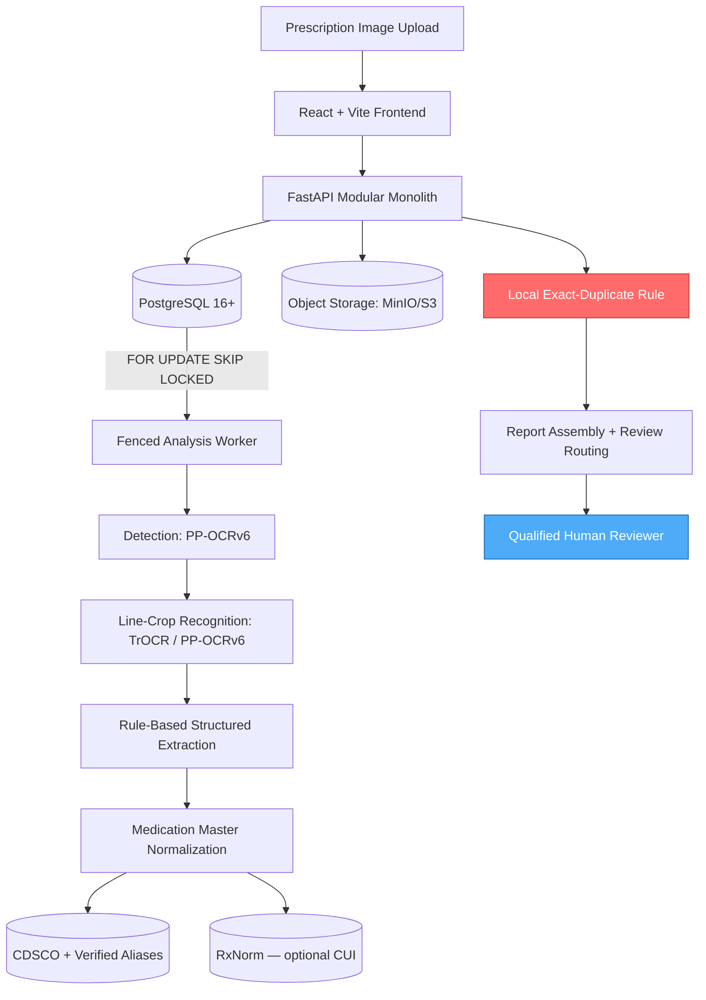
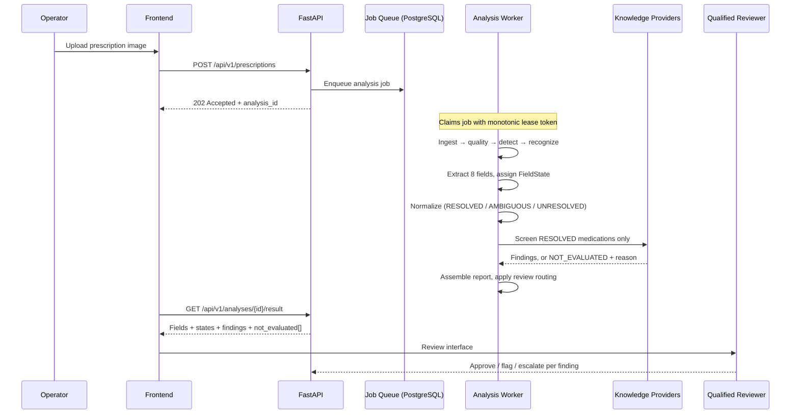

# Prescripto AI 2.0

### Prescription Document Intelligence & Medication-Safety Decision Support

[](https://www.python.org/)
[](https://fastapi.tiangolo.com/)
[](https://react.dev/)
[](https://pytorch.org/)
[](https://www.postgresql.org/)


Prescripto AI 2.0 extracts structured medication data from prescription images, resolves each drug to a canonical identity, screens the result against licensed safety sources, and presents a provenance-backed report to a qualified human reviewer.

It does not diagnose, prescribe, or claim comprehensive interaction coverage. **No finding is actionable until a qualified reviewer signs off.** This is an academic research prototype, not a cleared medical device.

---

## Table of Contents

- [Prescripto AI 2.0](#prescripto-ai-20)
    - [Prescription Document Intelligence \& Medication-Safety Decision Support](#prescription-document-intelligence--medication-safety-decision-support)
  - [Table of Contents](#table-of-contents)
  - [Problem](#problem)
  - [Approach](#approach)
  - [Project Status](#project-status)
  - [System Architecture](#system-architecture)
  - [Pipeline Flow](#pipeline-flow)
  - [Uncertainty Model](#uncertainty-model)
  - [Safety Boundary](#safety-boundary)
  - [What V1 Does and Doesn't Cover](#what-v1-does-and-doesnt-cover)
  - [Tech Stack](#tech-stack)
  - [Knowledge Sources](#knowledge-sources)
  - [Documentation](#documentation)
  - [Local Setup](#local-setup)
  - [Project Structure](#project-structure)
  - [Privacy \& Safety Design](#privacy--safety-design)
  - [Team](#team)
  - [References](#references)
  - [License](#license)

---

## Problem

Illegible handwriting on prescriptions is a documented source of medication error — misread dosages, duplicate medications, and missed interactions often go undetected until the pharmacy counter. Existing digitization tools stop at OCR: they convert handwriting to text and do nothing to verify the result is clinically sound.

The harder problem is that a verification system built carelessly is worse than none. A tool that reports "no interactions found" when it simply lacks the data, or reports a drug name it half-guessed, manufactures false confidence in exactly the situation where confidence is most dangerous.

## Approach

Prescripto is currently a documentation-only research prototype specification. The locked V1 goal is transcription, structured extraction, normalization candidates, and qualified human review. It does not yet have a runnable implementation or validated model.

Prescripto treats this as a pipeline problem with one governing rule:

> **Upstream uncertainty must never silently become downstream clinical certainty.**

If OCR is unsure, extraction inherits that doubt. If extraction is unsure, normalization does. If a knowledge source has no coverage, the report says so rather than staying quiet. Nothing rounds up to confident.

Concretely:

1. **Extraction** — line-level detection, then handwriting recognition on cropped lines. Every field gets one of four states: `CLEAR`, `AMBIGUOUS`, `UNREADABLE`, `NOT_PRESENT`.
2. **Normalization** — drug names resolve against an internal Medication Master (CDSCO-sourced + verified aliases, RxNorm CUI where one exists). No confident match means `UNRESOLVED` and a trip to human review — never a best guess.
3. **Screening** — one local rule may flag an exact repeated canonical product ID on the same document as `POTENTIAL`. DDI, dosage, allergy, adverse-event, and external evidence checks are out of scope in V1.
4. **Review** — a qualified reviewer sees the image, the fields with their states, the findings with their sources, and an explicit list of what was *not* checked.

Only two of eight pipeline stages use a learned model. Dosage parsing and safety screening are deterministic on purpose: a regex that mis-parses `500mg` is debuggable in minutes and fails identically every time; a model that does the same fails unpredictably and needs labeled data just to diagnose.

## Project Status

Documentation-first. Architecture is written and reviewed before implementation begins.

| Phase | Status |
|---|---|
| Product/architecture decision baseline | ✅ Updated 2026-10-02 |
| OCR pipeline and evaluation protocol | ✅ Specified; not empirically validated |
| Tier B evaluation dataset | 🔲 Not collected; blocks model selection and calibration |
| Legal/licensing review for data collection and CDSCO-derived master | 🔲 Outstanding |
| Implementation and machine-readable OpenAPI | 🔲 Not started |

No production code exists. Setup instructions below describe the target system.

---

## System Architecture


```mermaid
graph TD
    A[Prescription Image Upload] --> B[React + Vite Frontend]
    B --> C[FastAPI Modular Monolith]
    C --> D[(PostgreSQL 16+)]
    C --> E[(Object Storage: MinIO/S3)]
    D -->|FOR UPDATE SKIP LOCKED| F[Fenced Analysis Worker]
    F --> G[Detection: PP-OCRv6]
    G --> H[Line-Crop Recognition: TrOCR / PP-OCRv6]
    H --> I[Rule-Based Structured Extraction]
    I --> J[Medication Master Normalization]
    J --> J1[(CDSCO + Verified Aliases)]
    J --> J2[(RxNorm — optional CUI)]
    C --> K[Local Exact-Duplicate Rule]
    K --> L[Report Assembly + Review Routing]
    L --> M[Qualified Human Reviewer]

    style K fill:#ff6b6b,stroke:#c0392b,color:#fff
    style M fill:#4dabf7,stroke:#1864ab,color:#fff
```

Single deployable, three processes (`api`, `worker`, `deletion_worker`) from one image. No Redis, Kafka, Kubernetes, vector database, or microservices — each is deferred behind a measured trigger documented in the architecture, and none has fired.

## Pipeline Flow


```mermaid
sequenceDiagram
    participant U as Operator
    participant FE as Frontend
    participant API as FastAPI
    participant Q as Job Queue (PostgreSQL)
    participant W as Analysis Worker
    participant KB as Knowledge Providers
    participant HUM as Qualified Reviewer

    U->>FE: Upload prescription image
    FE->>API: POST /api/v1/prescriptions
    API->>Q: Enqueue analysis job
    API-->>FE: 202 Accepted + analysis_id
    Note over W: Claims job with monotonic lease token
    W->>W: Ingest → quality → detect → recognize
    W->>W: Extract 8 fields, assign FieldState
    W->>W: Normalize (RESOLVED / AMBIGUOUS / UNRESOLVED)
    W->>KB: Screen RESOLVED medications only
    KB-->>W: Findings, or NOT_EVALUATED + reason
    W->>W: Assemble report, apply review routing
    FE->>API: GET /api/v1/analyses/{id}/result
    API-->>FE: Fields + states + findings + not_evaluated[]
    FE->>HUM: Review interface
    HUM-->>API: Approve / flag / escalate per finding
```

Analysis is asynchronous throughout. Upload returns before processing starts; the client polls. Stage commits are guarded by lease validation and a generation fencing token, so a slow or crashed worker cannot duplicate findings when another worker picks the job up.

---

## Uncertainty Model

Four field states propagate through every stage:

| State | Meaning | Downstream |
|---|---|---|
| `CLEAR` | High calibrated confidence | Proceeds normally |
| `AMBIGUOUS` | Uncertain or conflicting | Inherited downstream; finding capped at `POTENTIAL` |
| `UNREADABLE` | Illegible | Structurally excluded — passing it downstream raises an exception |
| `NOT_PRESENT` | Absent from the document | Remains absent; never converted to zero, a default, or `AMBIGUOUS` |

Model confidence scores are **calibrated per model version** before use. Raw beam-search scores and CTC probabilities aren't comparable and aren't probabilities; thresholding them directly would make review routing arbitrary — which quietly breaks the human-in-the-loop guarantee the whole system rests on. A model without a calibration snapshot cannot load; the worker refuses to start.

There is deliberately **no single "overall confidence" score.** Five clear fields and one ambiguous field is not "96% confident" — it's five of one thing and one of another, reported as such.

## Safety Boundary

V1 has one local deterministic check: the same resolved, verified canonical product ID repeated within a prescription may be flagged as a `POTENTIAL` duplicate for reviewer attention. This is not a patient medication-history check and does not infer that the prescriptions are clinically unsafe.

Checks that cannot run are represented in a separate `not_evaluated[]` coverage list with a reason. They are not findings and can never be rendered as a negative result.

> **The distinction the system is built around:** `NO_KNOWN_INTERACTION_IN_DATABASE` ≠ `NO_INTERACTION_EXISTS`, and `NOT_EVALUATED` ≠ `SAFE`. These are separate values in the data model, the API response, and the UI. Collapsing them is the easiest way to build something actively dangerous.

## What V1 Does and Doesn't Cover

Stated plainly, because a safety tool that overstates its coverage is the failure mode worth avoiding most.

| V1 supports | Out of scope (and why) |
|---|---|
| Medication identity resolution | **Drug–drug interaction checking** — no legally obtainable Indian DDI dataset identified |
| Duplicate medication detection | **Dosage-range checking** — no licensed dosage reference integrated |
| Structured extraction of 8 fields with per-field confidence | **Allergy / contraindication checks** — no patient allergy record intake in V1 |
| Coverage-honest report and review routing | **All external evidence lookups** — no V1 third-party medication queries |
| Ambiguity detection and review routing | **Multi-language reports** — English only |
| Coverage-honest reporting | **Automated model deployment** — needs measured regression gates first |

**Not supported, by design:** diagnosis, treatment recommendation, autonomous prescribing, comprehensive clinical validation.

The LLM explanation layer is specified and deliberately switched off (`LLM_ENABLED=false`). The structured report is the complete V1 product — and because there's no stochastic stage, the pipeline is fully reproducible: same inputs and same pinned versions produce identical output.

---

## Tech Stack

| Layer | Technology | Rationale |
|---|---|---|
| Frontend | React 18, Tailwind, Vite | Types generated from OpenAPI — no shadow schema |
| API | Python 3.11, FastAPI | OpenAPI generated from Pydantic; spec is canonical |
| Database | PostgreSQL 16+ | Relational integrity, CHECK constraints as safety invariants, `FOR UPDATE SKIP LOCKED` job queue, JSONB, full-text search |
| Object storage | MinIO (dev) → S3 (prod) | boto3 only; swap is config |
| Job queue | PostgreSQL + lease tokens | No second datastore to keep in sync |
| Detection | PP-OCRv6 candidate | Evaluated on prescription-specific region and line-grouping metrics |
| Recognition | TrOCR-base / PP-OCRv6 candidates | No winner until Tier B lockbox evaluation |
| Extraction | Rule-based | Auditable and deterministic where errors are clinical |
| Deployment | Docker Compose | Same config for dev and deploy |

## Knowledge Sources

Every source's license is verified at its primary source before use. Reputation and "it's on HuggingFace" are not verification.

| Source | License | V1 role |
|---|---|---|
| **RxNorm** | Public terminology | Not queried at runtime in V1; US-centric and not the identity authority |
| **openFDA** | Public US data | Not queried at runtime; labels/FAERS do not establish Indian-market coverage or adverse-event causality |
| **SIDER 4.1** | CC BY-NC-SA 4.0 | Not used in V1; licensing and mapping constraints remain |
| **CDSCO** | Indian regulatory data | Candidate master source only after written reuse/legal clearance |
| **DrugBank** | Academic tier is non-clinical use only | ❌ Not used at runtime — the free tier doesn't clearly cover a clinical-decision-support use case |
| **MIMIC-IV** | PhysioNet credentialed | ❌ Not a dependency — contains no prescription images, wrong data type for this problem |

Evaluation requires a purpose-built, legally approved **Tier B** benchmark with independent annotation and a writer/source-grouped lockbox. The 200–500 count is a collection target, not proof of statistical adequacy. See [`EVALUATION-PLAN.md`](docs/EVALUATION-PLAN.md).

---

## Documentation

19 specification documents under [`docs/`](docs/); this is not a complete implementation package.

| Start here | Covers |
|---|---|
| [`PROJECT-SPEC.md`](docs/PROJECT-SPEC.md) | **Canonical** terminology, enums, conflict register |
| [`PRD_V1.md`](docs/PRD_V1.md) | Product requirements; alignment with the decision baseline is in progress |
| [`Architecture.md`](docs/Architecture.md) | Components, DDL, ADRs, execution model |
| [`ML-PIPELINES.md`](docs/ML-PIPELINES.md) and [`EVALUATION-PLAN.md`](docs/EVALUATION-PLAN.md) | OCR-to-report contract and evaluation gates |
| [`IMPLEMENTATION-PLAN.md`](docs/IMPLEMENTATION-PLAN.md) | Vertical slices and build order |

The machine-readable OpenAPI document, threat model, and test strategy are not present yet and remain implementation gates; no docs-only file substitutes for generated API schemas or verified tests.

---

## Local Setup

There is no runnable setup yet. The API, UI, Docker configuration, migrations, model registry, and OpenAPI schema must be implemented before setup instructions can be verified.

## Project Structure

```
Only `README.md`, `OPENAPI.yaml`, and files under `docs/` currently exist. The future code layout is described in [`Architecture.md`](docs/Architecture.md); it should not be mistaken for implemented files.

---

## Privacy & Safety Design

India is the intended research context. This specification does not establish DPDPA compliance or a lawful basis to collect/process personal data. Obtain current legal and ethics review before collecting real prescriptions; do not use real patient data in development or demos.

- **Verifiable deletion, not just a deleted row.** Deletion spans PostgreSQL, object storage, and derived artifacts, then writes an immutable manifest to a separately-permissioned retention vault. Without that manifest, a backup restore resurrects deleted data — so manifest re-application is a mandatory step in the restore procedure, not a note in a runbook.
- **Global knowledge preserved.** Deletion purges prescription-scoped records only. The canonical Medication Master and knowledge snapshots are never deleted — one user's erasure must not degrade the system for everyone.
- **No PHI in logs**, enforced by a whitelist processor that drops any unlisted field and increments a metric. A blacklist would need to predict every field a future developer might add.
- **Application-mediated storage.** No public bucket. Presigned GET URLs with a 60-second TTL, never logged or stored.
- **No third-party medication lookup in V1.** Medication names and prescription contents are not sent to openFDA, RxNorm, SIDER, or an LLM provider.
- **Human-in-the-loop.** No auto-approve path exists. No finding is actionable without a qualified reviewer.
- **Full reproducibility.** Every analysis pins its pipeline version, model version, checkpoint hash, calibration snapshot, and per-finding knowledge snapshot. `"latest"` is banned in production code paths and checked in CI.

Security controls are proposed in [`SECURITY.md`](docs/SECURITY.md); a threat model remains a pre-real-data gate. **Nothing here has been penetration-tested or independently audited** — the system is described as security-conscious, not secure.

---

## Team

| Name | Role |
|---|---|
| Dipak | System Architect |
| Bhushan | Backend Development |
| Aakanksha | Frontend Development |
| Prachi | AI/ML Engineer |

Third-year AI/ML project, R.C. Patel Institute of Technology, Shirpur.

## References

Lee, J., Yoon, W., Kim, S., Kim, D., Kim, S., So, C.H., Kang, J. (2020). *BioBERT: A Pre-trained Biomedical Language Representation Model for Biomedical Text Mining.* Bioinformatics, 36(4), 1234–1240. https://doi.org/10.1093/bioinformatics/btz682

Full reference list with verification status: [`docs/REFERENCES.md`](docs/REFERENCES.md).

## License

Not yet decided. To be added before any public release.
